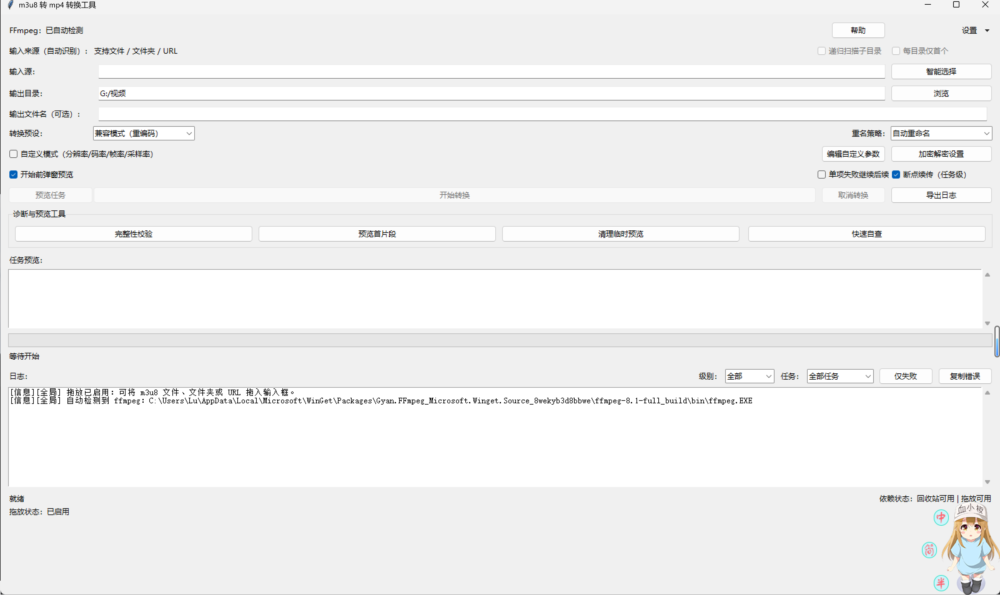
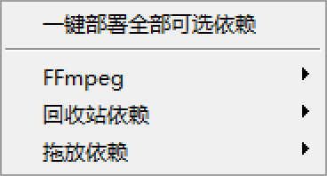
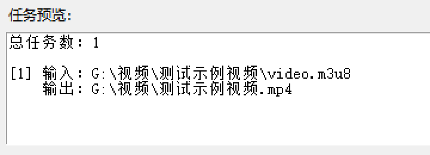

# m3u8ToMp4 - m3u8 转 mp4 工具

一个带图形界面的 m3u8 转 mp4 工具，支持本地文件、文件夹和 URL 输入，内置 FFmpeg 与依赖管理。

## 快速导航

- [功能特性](#功能特性)
- [快速开始](#快速开始)
- [截图预览](#截图预览)
- [设置菜单详解](#设置菜单详解)
- [打包为 EXE可选](#打包为-exe可选)
- [常见问题](#常见问题)

## 一眼了解

- 目标用户：希望把 m3u8 快速转换为 mp4 的日常用户
- 核心优势：本地 UI 操作、批量转换、可视化进度、配置可保存
- 扩展能力：依赖中心支持一键检测/部署 FFmpeg、`send2trash`、`tkinterdnd2`
- 适用系统：Windows（已集成 `winget` 自动安装流程）

---

## 功能特性

### 输入源支持
- **自动识别** - 支持文件、文件夹和 URL，无需手动切换模式
- **批量转换** - 可一次选择多个 `.m3u8` 文件进行批量转换
- **文件夹处理** - 可选递归扫描子目录
- **智能选择** - 按需选择优先使用文件或文件夹选择器
- **每目录仅首个** - 递归时可选加速处理（仅选取每个目录首个文件）

### 输出优化
- **目录结构保留** - 递归模式会按源目录结构在输出目录下创建对应子目录
- **智能命名** - 当文件名是 `video/index/playlist/master` 时，优先使用外层目录名
- **自定义文件名** - 可选自定义输出文件名（留空则使用原文件名）
- **冲突处理** - 支持三种重名策略：自动重命名、覆盖、跳过

### 转换控制
- **多种预设** - 提供极速封装、兼容重编码、高质量重编码三种预设
- **实时进度** - 转换过程显示实时进度，支持中途取消
- **任务预览** - 开始前可查看输入与目标输出路径
- **错误处理** - 支持单项失败继续后续任务

### 安全与便利
- **源文件处理** - 转换前询问是否删除本地源文件，支持永久删除或回收站
- **日志导出** - 支持导出日志为 `.txt` 文件
- **配置保存** - 自动保存常用配置（输出目录、ffmpeg 路径、预设、窗口大小）
- **帮助中心** - 内置帮助手册，左侧目录快速浏览章节

### FFmpeg 管理
- **一键检测** - 自动扫描 PATH 和常见安装位置
- **一键部署** - 通过 `winget` 自动安装（Windows）
- **手动选择** - 可指定本地可执行文件
- **路径恢复** - 可还原到命令名模式

### 可选依赖管理
- **依赖状态检测** - 可在设置中检查 `send2trash` 与 `tkinterdnd2` 是否可用
- **一键部署回收站依赖** - 未安装时可直接在设置里安装 `send2trash`
- **一键部署拖放依赖** - 未安装时可直接在设置里安装 `tkinterdnd2`

---

## 环境要求

- **Python** - 3.10 或更高版本
- **操作系统** - Windows（已适配 `winget` 一键部署）
- **FFmpeg** - 需要单独安装或通过工具部署

## 快速开始

### 运行程序

```powershell
python main.py
```

### 基本步骤

1. 在"输入源"中粘贴 URL，或点击"智能选择"
2. 若输入源是文件夹，程序会自动扫描该目录中的 `.m3u8` 文件
3. 递归扫描时可勾选"递归扫描子目录"和"每目录仅首个"选项
4. 选择输出目录
5. 可选填写输出文件名（批量时会自动追加序号）
6. 选择转换预设与重名策略
7. 可按需启用预览和继续选项
8. 点击"开始转换"

## 截图预览

> 你可以将真实截图放到 `assets/screenshots/` 目录，并保持以下文件名，README 会自动展示。

### 主界面



### 设置 - 依赖中心



### 转换任务预览



---

## 使用指南

### 输入源设置

#### 智能选择
- **说明** - "智能选择"按钮不会连续弹出两个选择框，每次只弹出最匹配的选择器
- **优先级** - 输入为空时，会优先沿用上次使用的来源类型（文件或文件夹）

#### 输入模式
- **本地文件** - 选择一个或多个 `.m3u8` 文件
- **文件夹** - 选择包含 `.m3u8` 的文件夹，可配合递归选项使用
- **URL** - 直接粘贴 `http` 或 `https` m3u8 地址

#### 拖放输入
- 启用拖放后，可直接拖入 `.m3u8` 文件、文件夹或 URL 到输入框/主界面
- 拖入多个 `.m3u8` 文件会自动进入批量模式
- 拖入文件夹会自动切换到文件夹扫描模式

### 转换预设选择

#### 极速封装（先拷贝）
- **速度** - 最快 | **质量** - 保持原质量
- **推荐** - 最常用，适合大多数场景

#### 兼容模式（重编码）
- **速度** - 中等 | **质量** - 重新编码，兼容性更好
- **推荐** - 当极速模式有兼容性问题时使用

#### 高质量（慢速重编码）
- **速度** - 最慢 | **质量** - 最高质量
- **推荐** - 对质量要求高时使用

### 重名冲突策略

#### 自动重命名（推荐）
- 自动为新文件追加序号（如 `video.mp4` → `video_2.mp4`）
- 不会覆盖已有文件

#### 覆盖同名文件
- 直接覆盖已有的同名文件
- **警告** - 谨慎使用，可能导致数据丢失

#### 跳过同名文件
- 如果目标文件已存在，则跳过该任务
- 适合续传场景

### 文件夹选项

#### 递归扫描子目录
- 启用后，将扫描选定文件夹及其所有子目录中的 `.m3u8` 文件
- 会保留源目录结构在输出目录中

#### 每目录仅首个
- 配合递归扫描使用
- 每个目录只选取首个 `.m3u8` 文件
- 可加速大型目录结构的处理

### 高级选项

#### 开始前弹窗预览
- 启用后，转换前会弹出对话框显示即将转换的任务
- 可在此时确认或取消

#### 单项失败继续后续
- 启用后，单个文件转换失败不会停止整个任务
- 所有失败项目会在日志中列出

#### 源文件删除改为回收站
- 在设置菜单中启用
- 启用后，删除源文件时优先移入回收站而非永久删除
- 若未安装 `send2trash`，可在设置中点击"一键部署回收站依赖"

---

## 设置菜单详解

### 依赖中心

点击"设置"菜单中的"依赖中心"，可统一管理 FFmpeg、回收站依赖和拖放依赖。

#### 状态栏依赖提示
- 主界面底部会同时显示回收站与拖放依赖状态
- 开启回收站删除但未安装依赖时，会明确提示将降级为永久删除
- 开启拖放但未安装依赖时，会明确提示拖放依赖缺失
- 主界面底部会单独显示"拖放状态：已启用/未启用/依赖缺失"，便于启动后快速确认

### FFmpeg 管理

#### 一键检测 FFmpeg
- 自动扫描系统 PATH 和常见安装位置
- 支持检测范围：项目根目录、Program Files、Scoop、WinGet、Chocolatey、C:\ffmpeg

#### 一键部署 FFmpeg
- 通过 Windows 包管理工具（WinGet）自动安装
- 首次使用时可便捷部署完整的 FFmpeg 环境
- 安装完成后自动检测路径

#### 手动选择 ffmpeg.exe
- 弹出文件选择对话框
- 选择本地的 ffmpeg 可执行文件
- 适用于非标准安装位置

#### 查看当前 FFmpeg 路径
- 显示当前配置的 FFmpeg 路径
- 用于验证配置是否正确

#### 恢复为默认 ffmpeg
- 将 FFmpeg 配置恢复为使用系统命令名 `ffmpeg`
- 依赖系统 PATH 环境变量

### 可选依赖管理

#### 一键部署全部可选依赖
- 可一次部署 `send2trash` 与 `tkinterdnd2`
- 已安装项会自动跳过，并在结果中汇总提示
- 若部分失败会显示失败项与原因，便于重试

#### 检测回收站依赖状态
- 用于确认 `send2trash` 是否可用
- 依赖可用时，源文件删除可走回收站模式

#### 一键部署回收站依赖
- 通过当前 Python 环境执行 `pip install send2trash>=1.8.3`
- 安装完成后无需重开工具即可生效（若导入失败会提示重启）

#### 检测 tkinterdnd2 状态
- 用于确认拖放依赖 `tkinterdnd2` 是否可用
- 若已安装，提示当前会话拖放是否已启用

#### 一键部署 tkinterdnd2
- 通过当前 Python 环境执行 `pip install tkinterdnd2>=0.4.2`
- 安装后建议重启应用以确保拖放窗口初始化

### 拖放开关

#### 启用拖放（需重启生效）
- 在设置中可开启/关闭拖放功能
- 启动时会结合该开关与 `tkinterdnd2` 是否可用决定是否启用拖放窗口

### 帮助中心

#### 卡片段落预览
- 右侧帮助内容以卡片段落展示，不再直接显示原始 Markdown
- 每个章节按小节拆分为可滚动卡片，便于快速阅读与定位

#### 目录搜索
- 左侧目录上方提供搜索框，可按章节标题与正文内容实时过滤
- 过滤时会保留命中条目的父级目录，便于理解层级位置
- 清空搜索关键词即可恢复完整目录
- 右侧卡片会对搜索关键词进行高亮标记
- 在搜索框中按 `Enter` 可跳转到下一个命中章节
- 在搜索框中按 `Shift + Enter` 可跳转到上一个命中章节

### 智能选择偏好

在设置菜单中选择：

#### 自动判断（推荐）
- 根据输入内容自动判断 | 最灵活，适合混合使用的场景

#### 总是文件选择器
- 始终使用文件选择对话框 | 适合主要处理单个或少数几个文件

#### 总是文件夹选择器
- 始终使用文件夹选择对话框 | 适合主要处理目录批量转换

### 默认输出目录

#### 设置默认输出目录
- 弹出文件夹选择对话框
- 后续启动时自动填入该路径
- 方便频繁输出到同一位置

#### 重置默认输出目录
- 恢复到程序工作目录（通常是 `m3u8ToMp4` 项目目录）

---

## 运行测试

### 执行单元测试

```powershell
python -m unittest discover -s tests -v
```

### 测试覆盖范围
- 转换器功能测试
- FFmpeg 部署功能测试
- 配置保存与加载测试

---

## 打包为 EXE（可选）

### 安装依赖

```powershell
pip install pyinstaller
```

### 打包命令

```powershell
./scripts/build_exe.ps1
```

说明：脚本会自动执行 `--add-data "README.md;."`，确保 EXE 内置帮助可正常读取文档。

### 输出位置
- 生成的 `m3u8ToMp4.exe` 位于 `dist` 目录下
- 可直接双击运行，无需 Python 环境

### 发布建议（GitHub Releases）

- 在 GitHub 仓库创建新 Release 时，可直接使用 `.github/RELEASE_TEMPLATE.md` 作为说明模板
- 仓库已提供 `.github/release.yml`，用于自动分类 GitHub 生成的发布说明
- 建议把 `dist` 目录中的 EXE 与说明文档一并上传到 Release 附件

---

## 常见问题

### FFmpeg 未被检测到

**问题** - 启动时显示"未检测到 FFmpeg"

**解决**
- 点击"一键部署 FFmpeg"自动安装
- 或点击"手动选择 ffmpeg.exe"手动指定路径
- 或将 FFmpeg 添加到系统 PATH 环境变量

### 转换速度很慢

**问题** - 转换过程耗时很长

**解决**
- 检查当前使用的预设（"高质量"模式最慢）
- 尝试切换到"极速封装"预设
- 确保系统中没有其他占用资源的程序

### 转换后文件损坏

**问题** - 转换成功但输出文件无法播放

**解决**
- 尝试更换转换预设
- 检查源 m3u8 文件是否完整
- 尝试使用"兼容模式"重新转换

---

**版本** - 1.0+  
**最后更新** - 2026年3月

